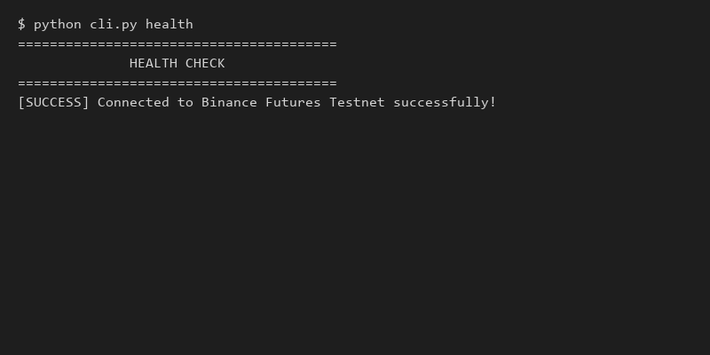
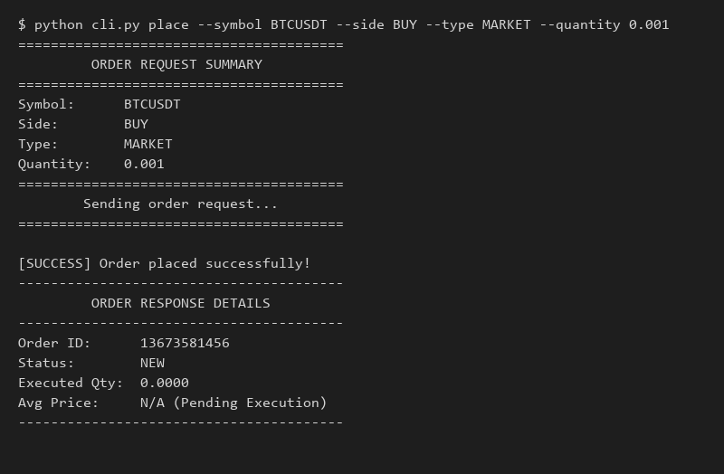
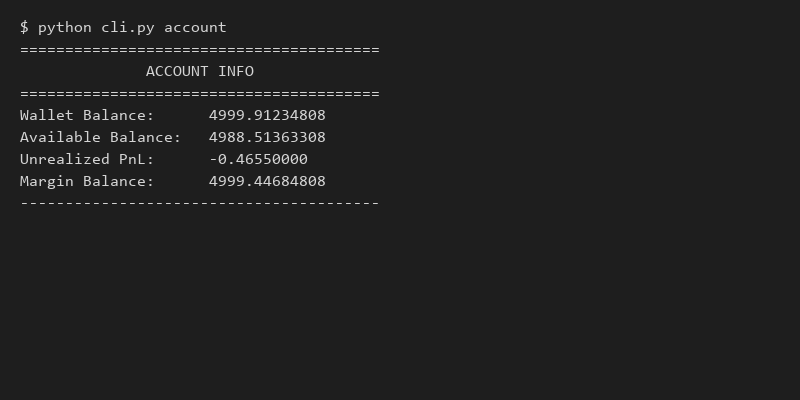

# Advanced Binance Futures Testnet Trading Bot (USDT-M)


## 📖 Overview
A professional-grade, modular Python trading bot that interacts directly with the **Binance Futures Testnet (USDT-M)**. Designed to demonstrate strong engineering discipline, it features an orchestrator pattern, automated retry logic for rate limits, structured JSON logging with correlation IDs, strict typing, and a complete Pytest suite.

---

## 🚀 Features
✓ **MARKET / LIMIT / STOP_LIMIT Orders**  
✓ **Account & Position Monitoring**  
✓ **Exchange Filter Validation**  
✓ **Structured Logging**  
✓ **Retry/Backoff Logic**  
✓ **Docker & CI/CD Supported**

---

## 🏛 Architecture Diagram

```text
┌─────────────────────┐
│      CLI Layer      │ (cli.py)
└──────────┬──────────┘
           │
           ▼
┌─────────────────────┐
│    Orders Layer     │ (Validation + Logic)
└──────────┬──────────┘
           │
           ▼
┌─────────────────────┐
│  Binance REST API   │ (HMAC + Retries)
└──────────┬──────────┘
           │
           ▼
┌─────────────────────┐
│ Binance Testnet API │
└─────────────────────┘
```

---

## ⚙️ Quick Start

### 1. Configuration
```bash
cp .env.example .env
# Add your Testnet API credentials to .env
```

### 2. Local Installation
```bash
python -m venv venv
source venv/bin/activate  # On Windows: .\venv\Scripts\activate
pip install -r requirements.txt
```

### 3. Execution
```bash
python cli.py interactive
```

---

## 📸 Screenshots

### Interactive Menu & Health


### Market Order Execution


### Account Dashboard


---

## 📁 Repository Structure

```text
trading_bot_task_0/
├── bot/                 # Core trading bot logic, clients, and validators
├── tests/               # Pytest unit tests (Mocks network layer)
├── docs/                # Architecture, design, and reference documentation
├── proof/               # Verifiable JSON logs of actual Testnet executions
├── screenshots/         # UI interaction examples
├── scripts/             # Utility scripts for evidence generation
├── cli.py               # Main interactive CLI entrypoint
├── requirements.txt     # Python dependencies
└── README.md
```

---

## 📚 Documentation Links

Deep dives into the system design, error handling, and API capabilities:

- [ARCHITECTURE.md](docs/ARCHITECTURE.md) - Request lifecycle and system layers.
- [DECISIONS.md](docs/DECISIONS.md) - Engineering tradeoffs and rationale.
- [API_REFERENCE.md](docs/API_REFERENCE.md) - Full CLI command guide and examples.
- [VALIDATION.md](docs/VALIDATION.md) - Error handling and local exchange filter rules.
- [Project_Overview.md](docs/Project_Overview.md) - 1-page executive summary.
