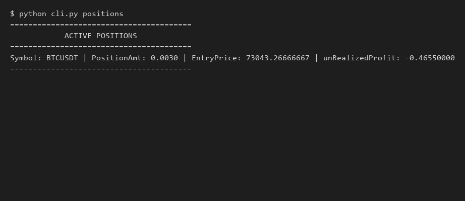

# Advanced Binance Futures Testnet Trading Bot (USDT-M)


A professional-grade, modular Python trading bot that interacts directly with the **Binance Futures Testnet (USDT-M)**. Designed to demonstrate strong engineering discipline, it features an orchestrator pattern, automated retry logic for rate limits, structured JSON logging with correlation IDs, strict typing, and a complete Pytest suite.

---

## 🏛 Architecture

```text
┌─────────────────────┐
│      CLI Layer      │
│ argparse commands   │
└──────────┬──────────┘
           │
           ▼
┌─────────────────────┐
│    Orders Layer     │
│ Validation + Logic  │
└──────────┬──────────┘
           │
           ▼
┌─────────────────────┐
│  Binance REST API   │
│ HMAC Authentication │
└──────────┬──────────┘
           │
           ▼
┌─────────────────────┐
│ Binance Testnet API │
└─────────────────────┘
```

See [docs/DESIGN.md](docs/DESIGN.md) for in-depth technical decisions, security considerations, and future improvements.

---

## 🔄 Request Lifecycle

```text
User Command
    ↓
Input Validation
    ↓
Exchange Filter Validation
    ↓
Request Signing (HMAC-SHA256)
    ↓
API Call
    ↓
Retry Logic (429 / 5xx)
    ↓
Response Parsing
    ↓
Structured Logging
    ↓
CLI Output
```

---

## 🚀 Features Matrix

| Feature | Status |
|----------|--------|
| MARKET Orders | ✅ |
| LIMIT Orders | ✅ |
| STOP_LIMIT Orders | ✅ |
| BUY / SELL | ✅ |
| Exchange Filters | ✅ |
| Health Check | ✅ |
| Open Orders | ✅ |
| Positions | ✅ |
| Account Info | ✅ |
| Retry Logic | ✅ |
| Structured Logging | ✅ |
| Docker | ✅ |
| GitHub Actions | ✅ |
| Pytest | ✅ |
| Ruff | ✅ |
| Mypy | ✅ |

---

## 📸 Screenshots

### Market Order


### Account Information


### Positions


---

## ⚙️ Production-Oriented Features

- Direct REST integration (no `python-binance` dependency)
- HMAC-SHA256 request signing
- Local exchange filter validation
- Exponential backoff for 429/5xx errors
- Request correlation IDs
- Structured JSON logging
- Docker support
- CI/CD with GitHub Actions
- Static type checking (`mypy`)
- Linting (`ruff`)

---

## 🛠 Why This Design?

This implementation intentionally uses direct REST requests instead of `python-binance` to demonstrate:
- **HMAC-SHA256 request signing**
- **Authentication handling**
- **Error management & resilient retries**
- **Strict exchange rule validation**
- **API abstraction design**

---

## 💻 CLI Usage

The bot supports several subcommands: `place`, `status`, `cancel`, `health`, `account`, `open-orders`, `positions`, and `interactive`.

### Interactive Mode (Recommended)
An interactive guided menu to seamlessly place, check, and cancel orders:
```bash
python cli.py interactive
```

### Health & Account Reports
```bash
# Verify API connectivity
python cli.py health

# Check wallet, available, and margin balances
python cli.py account

# List all open orders
python cli.py open-orders

# List active positions (positionAmt != 0)
python cli.py positions
```

### Place Orders
**MARKET Buy:**
```bash
python cli.py place --symbol BTCUSDT --side BUY --type MARKET --quantity 0.001
```

**LIMIT Sell:**
```bash
python cli.py place --symbol BTCUSDT --side SELL --type LIMIT --quantity 0.001 --price 95000
```

**STOP_LIMIT Order:**
```bash
python cli.py place --symbol BTCUSDT --side BUY --type STOP_LIMIT --quantity 0.001 --price 96000 --stop-price 95500
```

### Check Order Status
```bash
python cli.py status --symbol BTCUSDT --order-id 123456789
```

### Cancel Order
```bash
python cli.py cancel --symbol BTCUSDT --order-id 123456789
```

---

## 🚀 Quick Start (Local & Docker)

### 1. Configuration
Copy the environment template:
```bash
cp .env.example .env
```
Fill `.env` with your Testnet API credentials:
```env
BINANCE_API_KEY=your_actual_testnet_api_key
BINANCE_API_SECRET=your_actual_testnet_secret
```

### 2. Local Installation
Ensure Python 3.12+ is installed:
```bash
python -m venv venv
# On Windows:
.\venv\Scripts\activate
# On Linux/macOS:
source venv/bin/activate

pip install -r requirements.txt
```

### 3. Docker Installation
You can run the bot without installing Python locally:
```bash
docker build -t binance-bot .
docker run --env-file .env -it binance-bot interactive
```

---

## 🧪 Testing

The repository contains a robust Pytest suite checking signature logic, validation math, error handling, and orchestrator flows.

```bash
# Run the test suite locally
pytest
```

---

## 📂 Directory Structure
```text
trading_bot/
│
├── .github/workflows/
│   └── tests.yml          # CI Pipeline (Pytest, Ruff, Mypy)
├── bot/
│   ├── client.py          # REST Client (HMAC, Retry Backoff)
│   ├── orders.py          # Orchestrator & Exchange Filters
│   ├── validators.py      # Argument & Math validators
│   └── logging_config.py  # Structured JSON Logger + UUIDs
│
├── docs/
│   └── DESIGN.md          # Architecture & Tradeoffs
│
├── screenshots/
│   ├── account.png
│   ├── positions.png
│   └── limit_order.png    # Example demo images
│
├── tests/                 # Comprehensive Pytest Suite
│
├── Dockerfile             # Container definition
├── cli.py                 # Argparse CLI entry point
├── requirements.txt       # Dependencies (requests, mypy, ruff, pytest)
└── README.md              # Documentation
```
